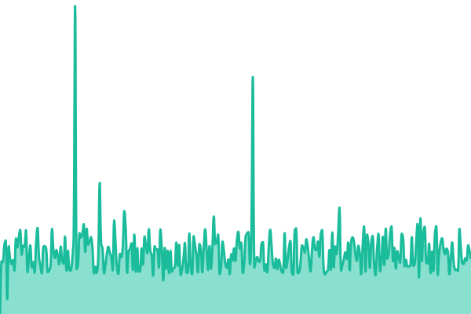

# Hubpay Status

Public status page and uptime monitor for [Hubpay](https://hubpay.io)'s customer-facing services: **https://status.hubpay.io**

## How it works

Powered by [Upptime](https://upptime.js.org), entirely inside this GitHub repository, with no third-party service:

- **Monitoring** — the [Uptime CI](https://github.com/Hubpay/uptime/actions/workflows/uptime.yml) workflow requests every endpoint in [`.upptimerc.yml`](.upptimerc.yml) every 5 minutes from GitHub-hosted runners and records the result in [`history/`](history).
- **Incidents** — a failed check opens a [GitHub issue](https://github.com/Hubpay/uptime/issues?q=label%3Astatus) labelled `status`; it is closed automatically when the endpoint recovers. Post-incident notes go in issue comments and appear on the status page.
- **Status page** — the [Static Site CI](https://github.com/Hubpay/uptime/actions/workflows/site.yml) workflow builds the site to the `gh-pages` branch, served by GitHub Pages at [status.hubpay.io](https://status.hubpay.io).
- **Changes** — edit `.upptimerc.yml` (endpoints, branding, notifications) and commit to `master`; then run the _Static Site CI_ workflow to republish the page.

Current live status: <!--live status--> **🟩 All systems operational**

<!--start: status pages-->
<!-- This summary is generated by Upptime (https://github.com/upptime/upptime) -->
<!-- Do not edit this manually, your changes will be overwritten -->
<!-- prettier-ignore -->
| URL | Status | History | Response Time | Uptime |
| --- | ------ | ------- | ------------- | ------ |
|  [Website](https://hubpay.io) | 🟩 Up | [hubpay-website.yml](https://github.com/Hubpay/uptime/commits/HEAD/history/hubpay-website.yml) | 

 316ms
     
 | 

<a href="https://status.hubpay.io/history/hubpay-website">100.00%</a>
    

|  [Hubpay Business](https://business.hubpay.io/auth/signin) | 🟩 Up | [business-portal.yml](https://github.com/Hubpay/uptime/commits/HEAD/history/business-portal.yml) | 

 545ms
     
 | 

<a href="https://status.hubpay.io/history/business-portal">100.00%</a>
    

|  [Hubpay app](https://wallet.hubpay.ae/actuator/health/liveness) | 🟩 Up | [wallet-api-spring-boot-health.yml](https://github.com/Hubpay/uptime/commits/HEAD/history/wallet-api-spring-boot-health.yml) | 

 636ms
     
 | 

<a href="https://status.hubpay.io/history/wallet-api-spring-boot-health">100.00%</a>
    

|  [API](https://api.hubpay.ae/actuator/health/liveness) | 🟩 Up | [public-api-spring-boot-health.yml](https://github.com/Hubpay/uptime/commits/HEAD/history/public-api-spring-boot-health.yml) | 

 693ms
     
 | 

<a href="https://status.hubpay.io/history/public-api-spring-boot-health">100.00%</a>
    

<!--end: status pages-->

[**Visit our status website →**](https://status.hubpay.io)

## 📄 License

- Powered by: [Upptime](https://github.com/upptime/upptime)
- Code: [MIT](./LICENSE) © [Anand Chowdhary](https://anandchowdhary.com)
- Data in the `./history` directory: [Open Database License](https://opendatacommons.org/licenses/odbl/1-0/)
